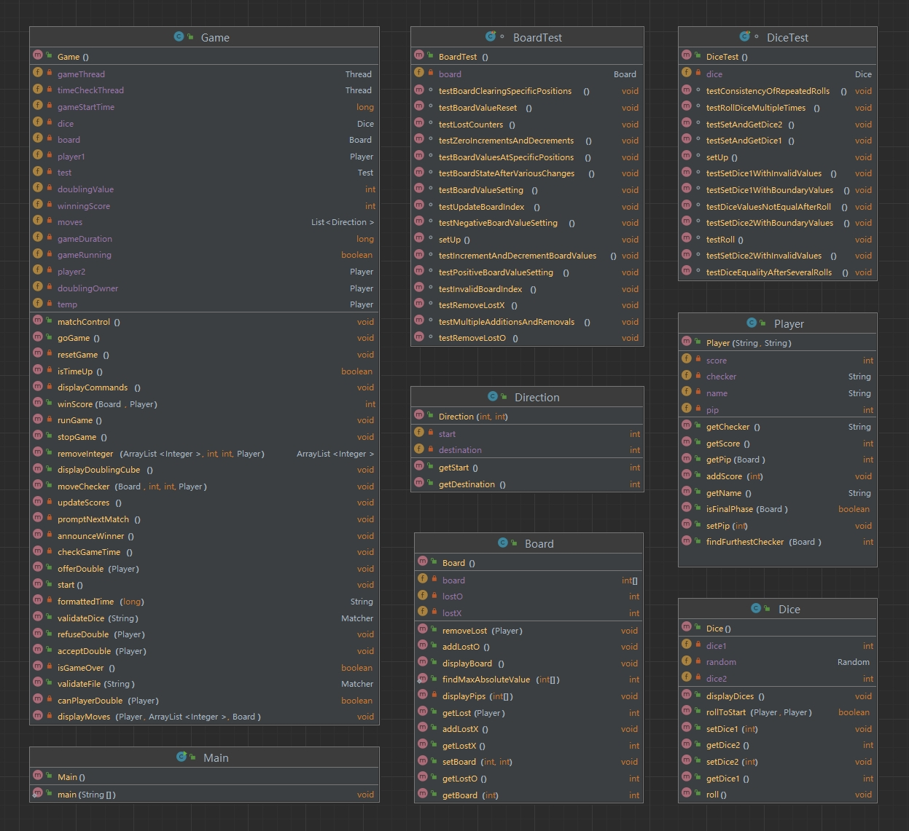
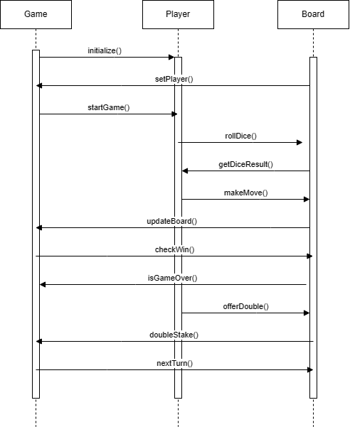

# Software Engineering Group Project
COMP41670-Software Engineering(2023-2024)

A Java Implementation of Backgammon game

## Group Members
Group number:40

SHUNYI XU,
SHU CHEN,
LING FENG

## Project Description
This is a backgammon game run in terminal, implemented using Java.

## Class Diagram

## Sequence Diagram

## Setup Requirements
run on Java version 20

## Development Environment
jdk-20
IntelliJ IDEA  2023.2

## Relevant Demo Video
https://youtu.be/R2JbHC_HjwY